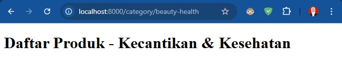
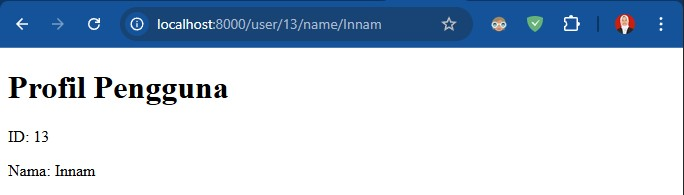
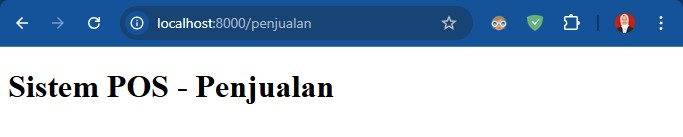

# Daftar Pertanyaan Praktikum

Nama    : Innama Maesa Putri  
Kelas   : TI 2A  
Absen   : 13  

# Jobsheet 2

## Pertanyaan Jobsheet 2
1. Jalankan Langkah-langkah Praktikum pada jobsheet di atas. Lakukan sinkronisasi
perubahan pada project PWL_2025 ke Github.
2. Buatlah project baru dengan nama POS. Project ini merupakan sebuah aplikasi Point of
Sales yang digunakan untuk membantu penjualan.
3. Buatlah beberapa route, controller, dan view sesuai dengan ketentuan sebagai berikut
<table>
    <tr>
        <td>1</td>
        <td>
            <b>Halaman Home</b> 
            Menampilkan halaman awal website
        </td>
    </tr>
    <tr>
        <td>2</td>
        <td>
            <b>Halaman Products</b> 
            Menampilkan daftar product (route prefix) 
            /category/food-beverage 
            /category/beauty-health 
            /category/home-care 
            /category/baby-kid
        </td>
    </tr>
    <tr>
        <td>3</td>
        <td>
            <b>Halaman User</b> 
            Menampilkan profil pengguna (route param) 
            /user/{id}/name/{name}
        </td>
    </tr>
    <tr>
        <td>4</td>
        <td>
        <b>Halaman Penjualan</b> 
        Menampilkan halaman transaksi POS
</td>
    </tr>
</table>
4. Route tersebut menjalankan fungsi pada Controller yang berbeda di setiap halaman.
5. Fungsi pada Controller akan memanggil view sesuai halaman yang akan ditampilkan.
6. Simpan setiap perubahan yang dilakukan pada project POS pada Git, sinkronisasi
perubahan ke Github.

## Jawaban
Hasil :  

 
Nb : Untuk kode program terdapat pada folder PWL_POS