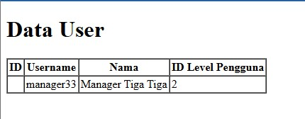
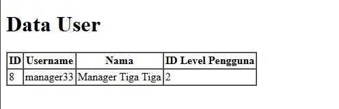

# Laporan Praktikum

Nama    : Innama Maesa Putri <br>
Kelas   : TI 2A <br>
Absen   : 13 <br>

## Prakikum 1
Variable ```$fillable``` berguna untuk mendaftarkan atribut (nama kolom) yang bisa kita isi ketika melakukan insert atau update ke database. <br>
 <br>
Menujukkan jika kolom kolom yang ditambahkan pada variable ```$fillable``` akan terisi dengan data yang telah ditambahkan pada controller. Namun ketika salah satu kolom dihapus dari variable ```$fillable``` maka hasilnya akan seperti berikut : <br>
 <br>

## Praktikum 2.1
Selain mengambil semua rekaman yang cocok dengan kueri tertentu, pada Laravel juga mendukung mengambil rekaman tunggal menggunakan metode find, first, atau firstWhere, yang mana ketiga sintaks tersebut mengembalikan hasil yang sama berupa baris pertama pada database seperti berikut, <br>
 <br>
Terkadang mungkin terdapat suatu kondisi untuk melakukan beberapa tindakan lain jika tidak ada hasil yang ditemukan. Metode findOr and firstOr akan mengembalikan satu contoh model atau, jika tidak ada hasil yang ditemukan maka akan menjalankan didalam fungsi. <br>
 <br>
Maka halaman web akan menampilkan kolom pada sintaks findOr saja dan kolom lain akan dikosongkan. Namun jika findOr diisi parameter baris database yang belum dibuat maka akan menampilkan halaman 404 not found seperti berikut, <br>
 <br>

## Praktikum 2.2
Jika ingin memberikan pengecualian jika model tidak ditemukan. Hal ini sangat berguna dalam rute atau pengontrol. Metode findOrFail and firstOrFail akan mengambil hasil pertama dari kueri; namun, jika tidak ada hasil yang ditemukan, sebuah Illuminate\Database\Eloquent\ModelNotFoundException akan dilempar. <br>
Hasil jika model ditemukan : <br>
 <br>
Jika model tidak ditemukan maka akan mengembalikan halaman 404 not found seperti berikut, <br>
 <br>

## Praktikum 2.3
Saat berinteraksi dengan model Eloquent, juga dapat menggunakan metode agregat ```count, sum, max,``` dan lainnya yang disediakan oleh pembuat kueri Laravel. Pada praktikum ini dilakukan count pada baris yang memiliki level_id = 2, awalnya hasil tidak dapat ditampilkan seperti berikut, 
 <br>
Namun setelah beberapa modifikasi pada controller dan view hasilnya seperti berikut <br>
 <br>

## Praktikum 2.4
<b>Metode firstOrCreate</b> merupakan metode untuk melakukan retrieving data(mengambil data) berdasarkan nilai yang ingin dicari, jika data tidak ditemukan maka method ini akan melakukan insert ke table datadase tersebut sesuai dengan nilai yang dimasukkan.<br>
Jika data ditemukan maka akan menampilkan data seperti berikut, <br>
 <br>
Namun, jika data tidak ditemukan maka akan membuat data baru seperti ini, <br>
 <br>
<b>Metode firstOrNew</b>, seperti firstOrCreate, akan mencoba menemukan/mengambil record/data dalam database yang cocok dengan atribut yang diberikan. Namun, jika data tidak ditemukan, data akan disiapkan untuk di-insert-kan ke database dan model baru akan dikembalikan. <br>
Jika data ditemukan maka akan menampilkan data seperti berikut, <br>
 <br>
Namun, jika data tidak ditemukan maka akan menyiapkan data baru seperti ini, <br>
 <br>
Dapat dilihat pada ID yang masih kosong, data tersebut belum tersimpan, jika ingin menyimpan dapat memanggil fungsi ```save()``` seperti dibawah,
 <br>

## Praktikum 2.5
Eloquent menyediakan metode isDirty, isClean, dan wasChanged untuk memeriksa keadaan internal model dan menentukan bagaimana atributnya berubah sejak model pertama kali diambil.
Metode isDirty menentukan apakah ada atribut model yang telah diubah sejak model diambil. Anda dapat meneruskan nama atribut tertentu atau serangkaian atribut ke metode isDirty untuk menentukan apakah ada atribut yang "kotor". Metode ini isClean akan menentukan apakah suatu atribut tetap tidak berubah sejak model diambil. <br>
 <br>
Program menampilkan hasil return isDirty yang terakhir. <br>
Metode ini wasChanged menentukan apakah ada atribut yang diubah saat model terakhir disimpan dalam siklus permintaan saat ini. <br>
 <br>
Jika tidak ada fungsi ```dd()``` maka akan menampilkan data yang barusan ditambah atau isi dari array ```$user```. <br>
 <br>
Menambahkan fungsi ```dd()``` untuk menampilkan hasil return ```isDirty()```

## Praktikum 2.6
Seperti yang telah kita ketahui, CRUD merupakan singkatan dari Create, Read, Update dan Delete. CRUD merupakan istilah untuk proses pengolahan data pada database, seperti input data ke database, menampilkan data dari database, mengedit data pada database dan menghapus data dari database.<br>
- Menampilkan data : <br>
 <br>
- Menambah data : <br>
 <br>
 <br>
 <br>
- Mengubah data : <br>
 <br>
 <br>
- Menghapus data : <br>
 <br>

## Praktikum 2.7
<b>One to Many (Inverse) / Belongs To</b><br>
Hubungan satu-ke-banyak digunakan untuk mendefinisikan hubungan di mana satu model adalah induk dari satu atau lebih model turunan. Misalnya, 1 kategori mungkin memiliki jumlah barang yang tidak terbatas. <br>
 <br>