# Laporan Praktikum

Nama    : Innama Maesa Putri  
Kelas   : TI 2A  
Absen   : 13  

## Praktikum 1
Pada praktikum ini tidak ada output pada halaman web, hanya templating (memisahkan) bagian adminlte untuk template web di praktikum selanjutnya.  

## Praktikum 2
Menampilkan halaman utama (dashboard) dari PWL_POS setelah dilakukan web layouting.  
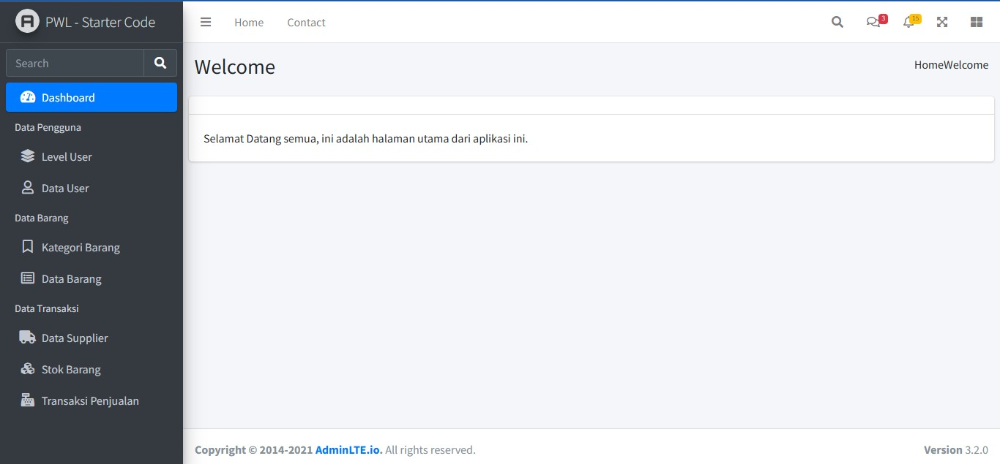 

## Praktikum 3
Menampilkan semua data user menggunakan datatables  
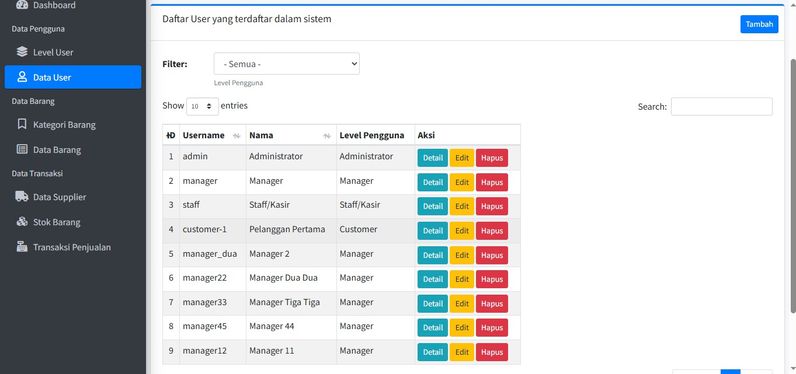 
Formulir untuk menambah data user  
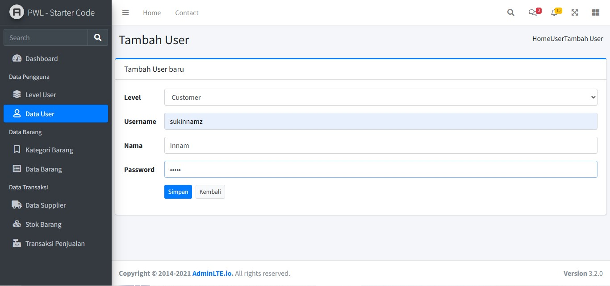 
Detail tiap user  
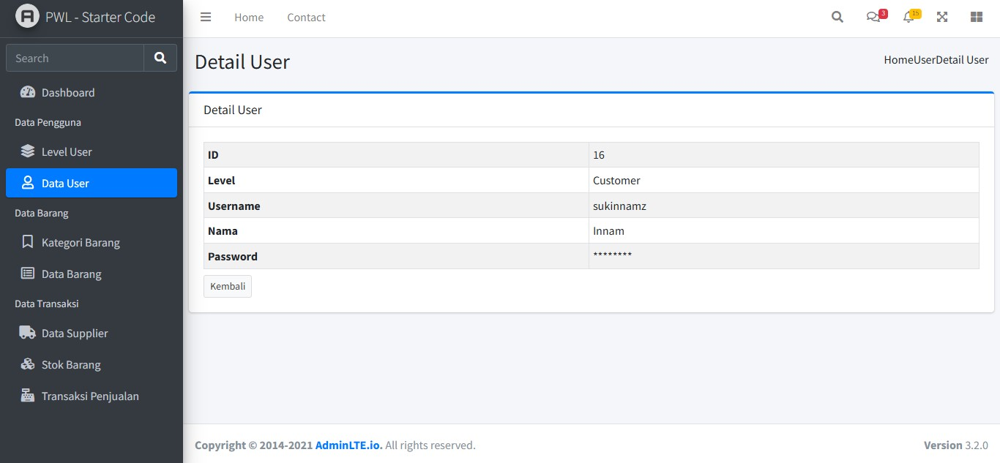 
Formulir untuk menamengedit data user  
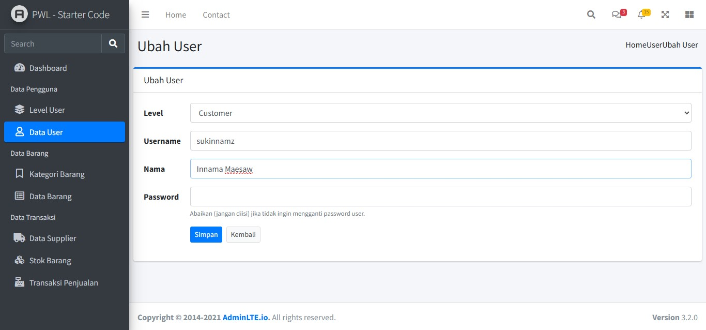 
Konfirmasi ketika menghapus data user  
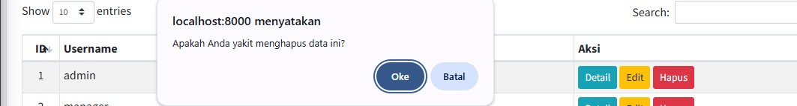 

## Praktikum 4
Filtering data user 
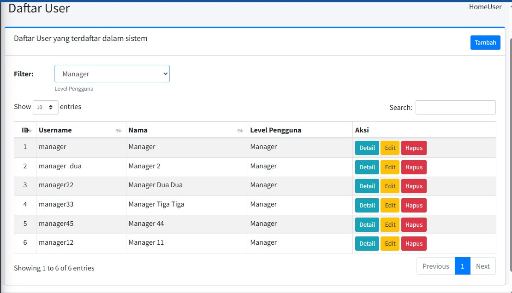 

## Tugas
- Data level
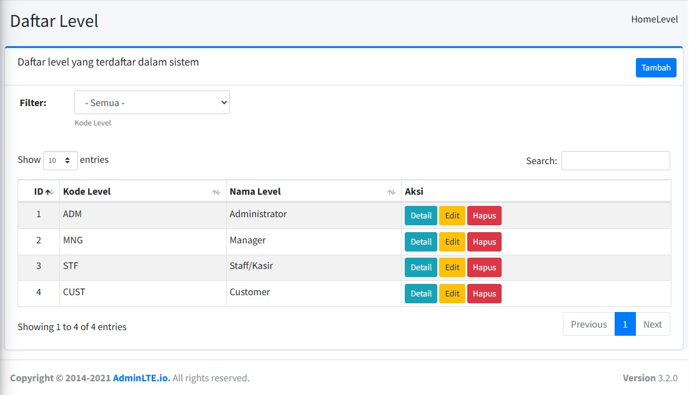 
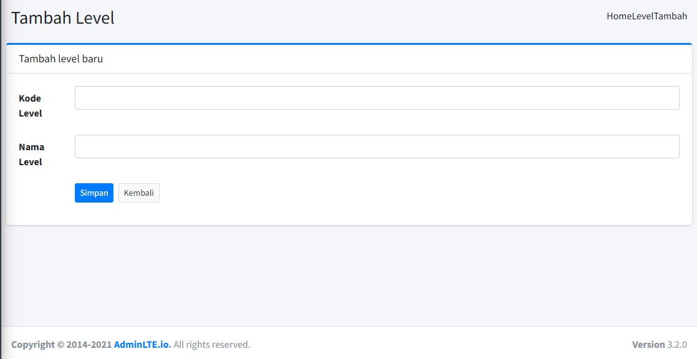 
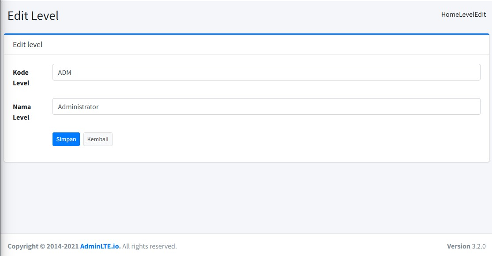 
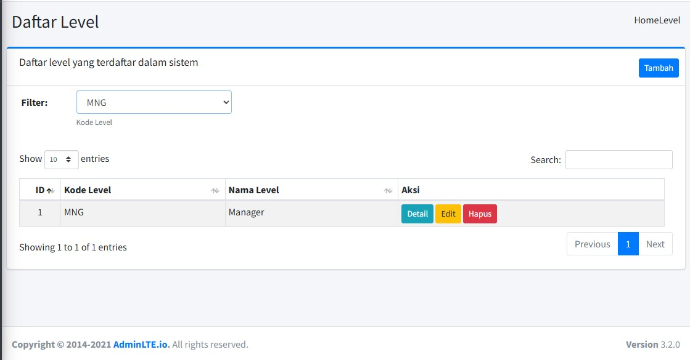 
- Data Kategori
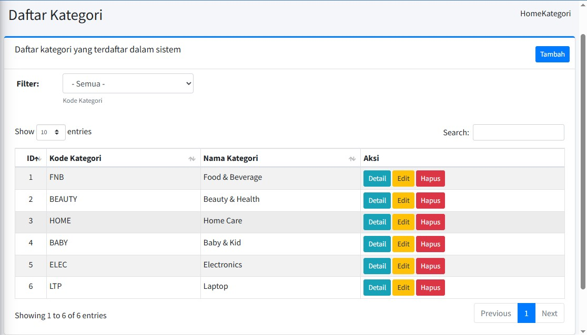 
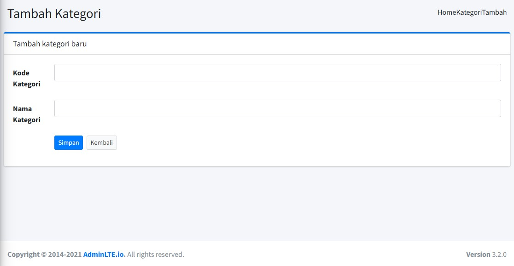 
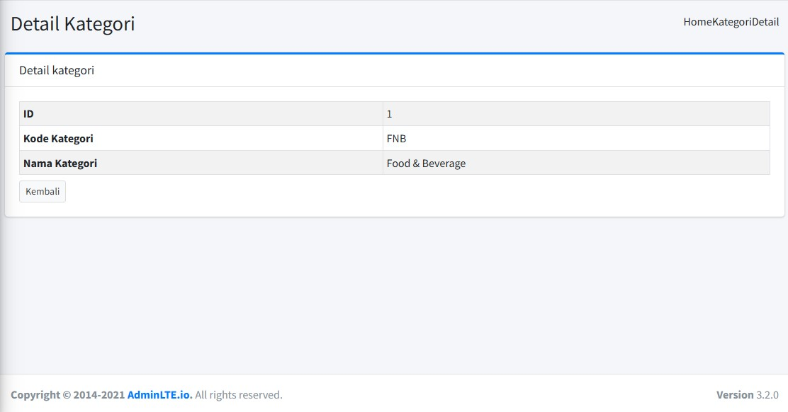 
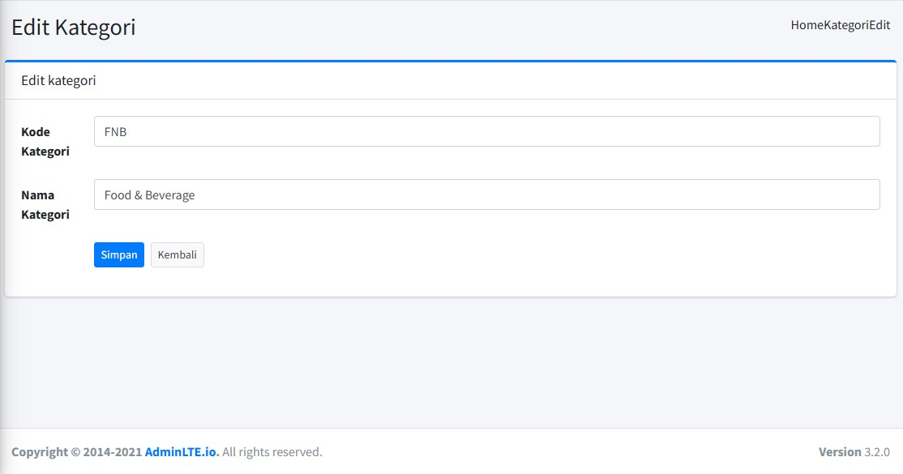 
- Data Supplier
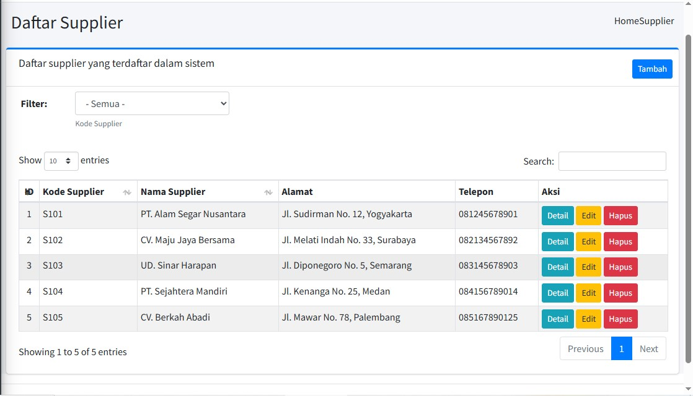 
- Data Barang
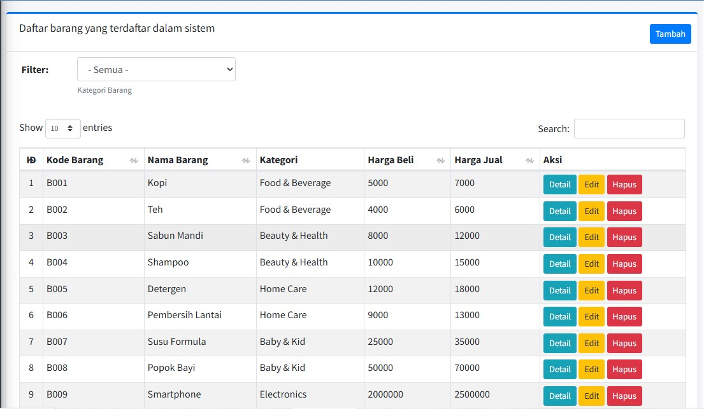 