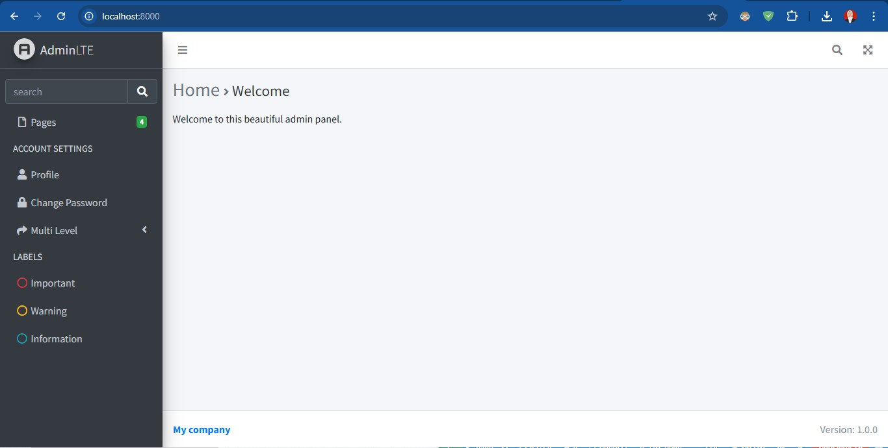
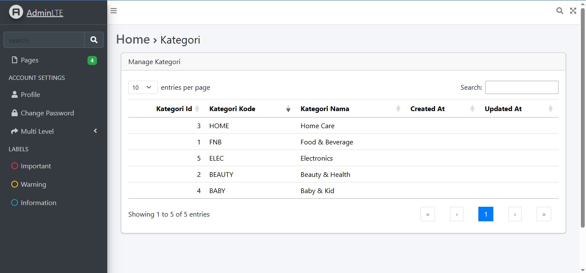
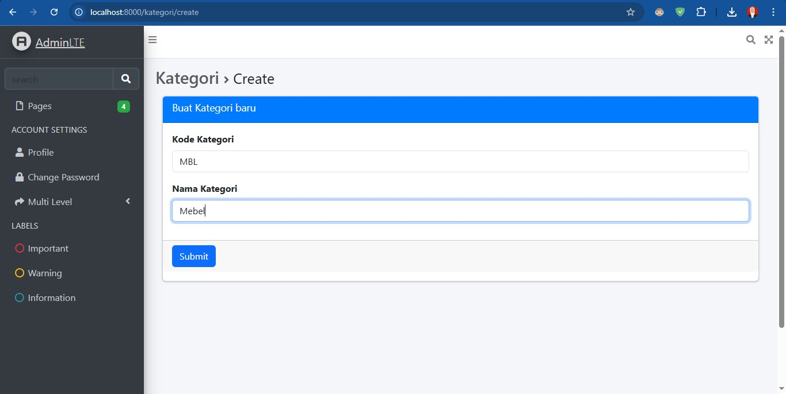
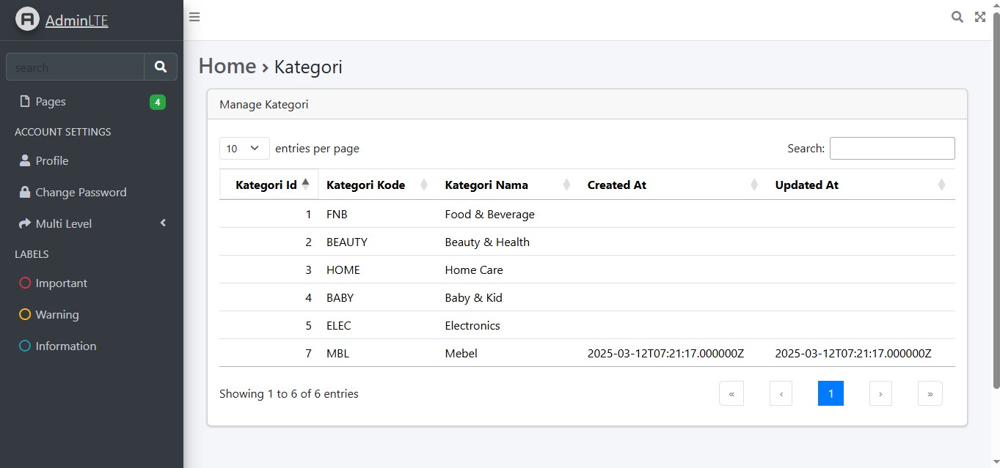
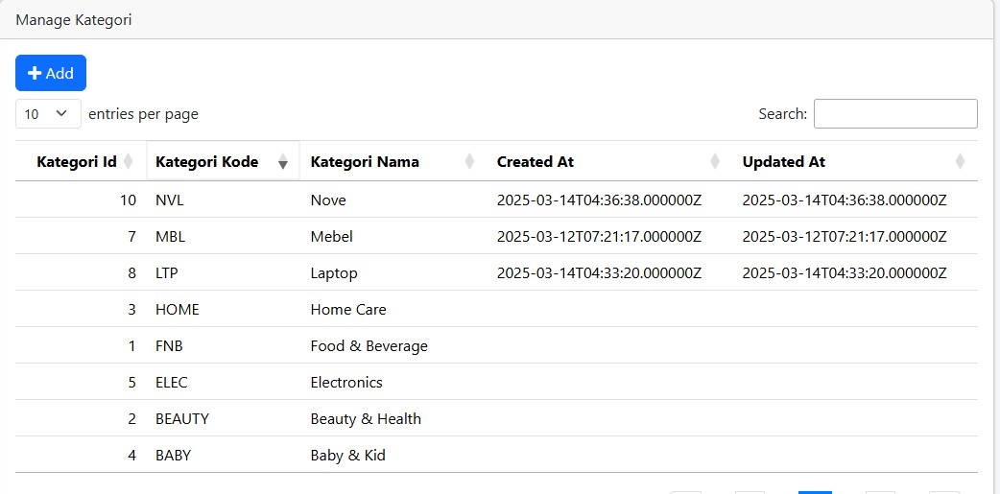
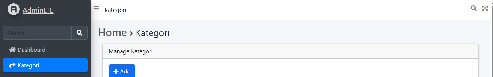
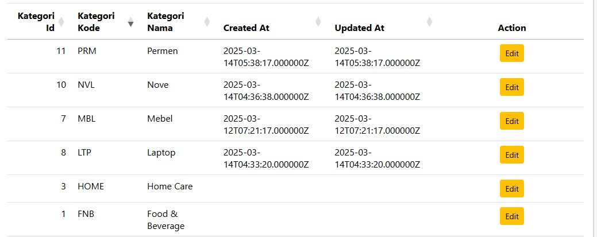
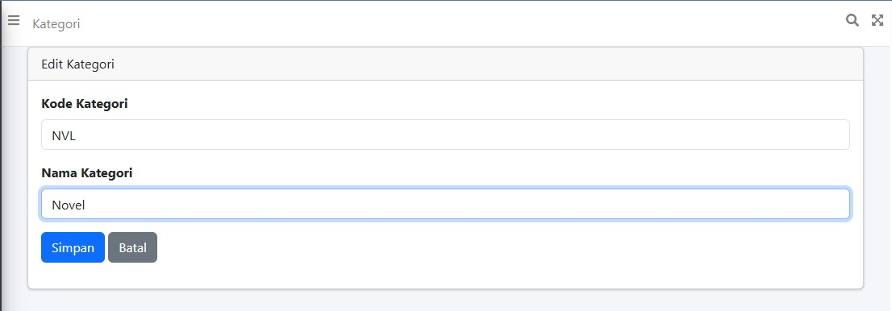
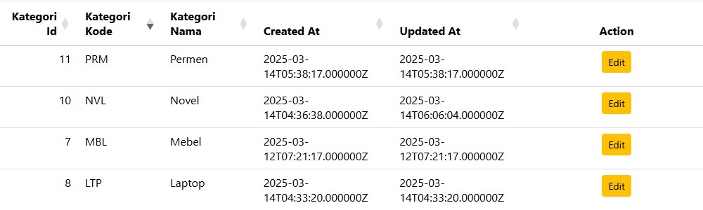
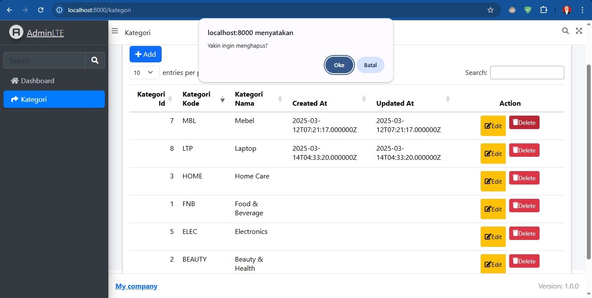

# Laporan Praktikum

Nama    : Innama Maesa Putri <br>
Kelas   : TI 2A <br>
Absen   : 13 <br>

## Praktikum 1
Pada laravel, layout digunakan untuk membuat master view yang akan selalu ditampilkan oleh view-view child yang menggunakannya. Dalam sebuah layout kita bisa memberikan tempat-tempat yang bisa digunakan oleh child view. Tempat-tempat tersebut adalah section. Misalnya, dalam layout utama, kita definisikan section sidebar, main_content, dan footer. Selanjutnya, setiap child view yang menggunakan layout utama dapat menempatkan kode view di masing-masing section yang tersedia di layout utama. Pada layout, setiap kode html akan digunakan oleh child view. Sehingga child view tidak perlu mendefinisikan tag html, head, title, dll pada tiap-tiap view. Terdapat beberapa istilah yang digunakan untuk menerapkan layout. <br>
Untuk menggunakan blade template ini cukup dengan extend AdminLTE layout dengan cara ```@extends('adminlte::page')```. <br>
Hasil :
<br>

## Praktikum 2
Datatables biasa digunakan untuk menampilkan list data dengan banyak fitur seperti searching, pagination,sorting dan lain-lainnya. Dalam laravel biasa digunankan yajra datatables
karena didesain agar sesuai dengan laravel.
<br>
Hasil :
<br>

## Praktikum 3
Hasil /kategori/create : <br>
<br>
Hasil /kategori/ : <br>
<br>

## Tugas
1. Tambahkan button Add di halam manage kategori, yang mengarah ke create kategori baru<br>
```
<a href="{{ url('/kategori/create') }}" class="btn btn-primary">
<i class="fas fa-plus"></i> Add
</a>
```
<br>
2. Tambahkan menu untuk halaman manage kategori, di daftar menu navbar
```
    'menu' => [
        // Navbar items:
        [
            'type' => 'navbar-search',
            'text' => 'search',
            'topnav_right' => true,
        ],
        [
            'type' => 'fullscreen-widget',
            'topnav_right' => true,
        ],
        [
            'text' => 'Kategori',
            'url' => '/kategori',
            'topnav' => true, // Ini akan menampilkan menu di navbar
        ],

        // Sidebar items:
        [
            'type' => 'sidebar-menu-search',
            'text' => 'Search',
        ],
        [
            'text' => 'Dashboard',
            'url' => '/',
            'icon' => 'fas fa-fw fa-home',
        ],
        [
            'text' => 'Kategori',
            'url' => '/kategori',
            'icon' => 'fas fa-fw fa-share',
        ],
    ],
```
<br>
3. Tambahkan action edit di datatables dan buat halaman edit serta controllernya
```
public function dataTable(QueryBuilder $query): EloquentDataTable
    {
        return (new EloquentDataTable($query))
            ->addColumn('action', function ($row) {
                $editUrl = url('/kategori/edit', $row->kategori_id);
                $deleteUrl = url('/kategori/delete', $row->kategori_id);
                $csrfToken = csrf_token();

                return '
                <div class="btn-group gap-2" role="group">
    <a href="' . $editUrl . '" class="btn btn-warning btn-sm d-flex align-items-center">
        <i class="fas fa-edit"></i> Edit
    </a>
    <form action="' . $deleteUrl . '" method="POST" style="display:inline;">
        <input type="hidden" name="_method" value="POST">
        <input type="hidden" name="_token" value="' . $csrfToken . '">
        <button type="submit" class="btn btn-danger btn-sm d-flex align-items-center"
            onclick="return confirm(\'Yakin ingin menghapus?\')">
            <i class="fas fa-trash"></i>    Delete
        </button>
    </form>
</div>
            ';
            })
            ->rawColumns(['action'])
            ->setRowId('id');
    }
```
```
public function edit($id)
    {
        $kategori = KategoriModel::findOrFail($id);
        return view('kategori.edit', compact('kategori'));
    }

    public function update(Request $request, $id)
    {
        $request->validate([
            'kategori_kode' => 'required|string|max:10',
            'kategori_nama' => 'required|string|max:100',
        ]);

        $kategori = KategoriModel::findOrFail($id);
        $kategori->update([
            'kategori_kode' => $request->kategori_kode,
            'kategori_nama' => $request->kategori_nama,
        ]);

        return redirect('/kategori');
    }
```
<br>
<br>
<br>
4. Tambahkan action delete di datatables serta controllernya
```
public function dataTable(QueryBuilder $query): EloquentDataTable
    {
        return (new EloquentDataTable($query))
            ->addColumn('action', function ($row) {
                $editUrl = url('/kategori/edit', $row->kategori_id);
                $deleteUrl = url('/kategori/delete', $row->kategori_id);
                $csrfToken = csrf_token();

                return '
                <div class="btn-group gap-2" role="group">
    <a href="' . $editUrl . '" class="btn btn-warning btn-sm d-flex align-items-center">
        <i class="fas fa-edit"></i> Edit
    </a>
    <form action="' . $deleteUrl . '" method="POST" style="display:inline;">
        <input type="hidden" name="_method" value="POST">
        <input type="hidden" name="_token" value="' . $csrfToken . '">
        <button type="submit" class="btn btn-danger btn-sm d-flex align-items-center"
            onclick="return confirm(\'Yakin ingin menghapus?\')">
            <i class="fas fa-trash"></i>    Delete
        </button>
    </form>
</div>
            ';
            })
            ->rawColumns(['action'])
            ->setRowId('id');
    }
```
```
    public function destroy($id)
    {
        $kategori = KategoriModel::findOrFail($id);
        $kategori->delete();

        return redirect('/kategori');
    }
```
<br>