# Laporan Praktikum

Nama    : Innama Maesa Putri  
Kelas   : TI 2A  
Absen   : 13  

## Praktikum 1
Melakukan tambah data menggunakan ajax, dapat dilihat pada proses ini tampilan berbeda dengan sebelumnya, yang mana berada di dalam semacam pop up dan terdapat validasi saat mengisi formulir.  
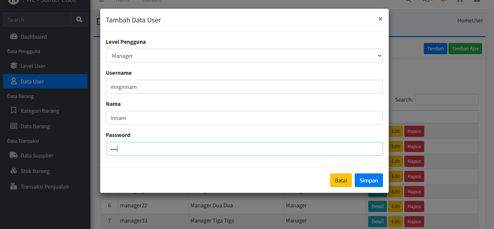 
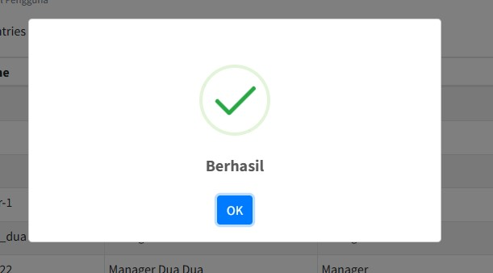 

## Praktikum 2
Melakukan edit data menggunakan ajax, dapat dilihat pada proses ini tampilan berbeda dengan sebelumnya, yang mana berada di dalam semacam pop up dan terdapat validasi saat mengisi formulir.  
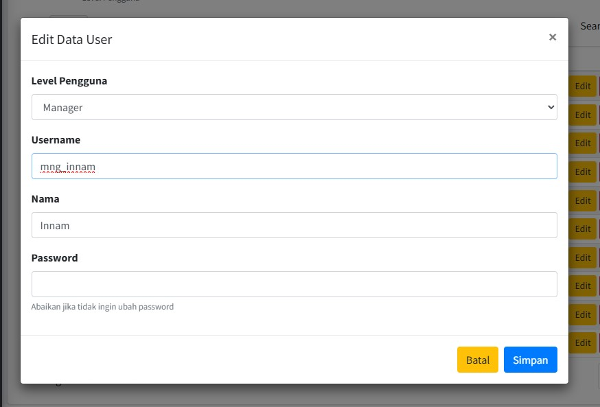 
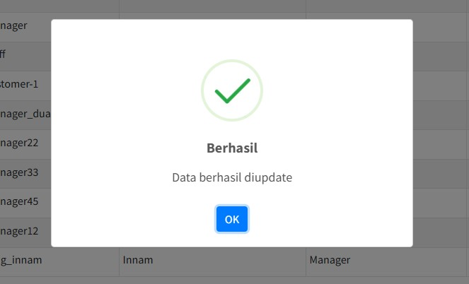 

## Praktikum 3
Melakukan hapus data menggunakan ajax, dapat dilihat pada proses ini tampilan berbeda dengan sebelumnya, yang mana berada di dalam semacam pop up untuk memastikan data yang akan dihapus.  
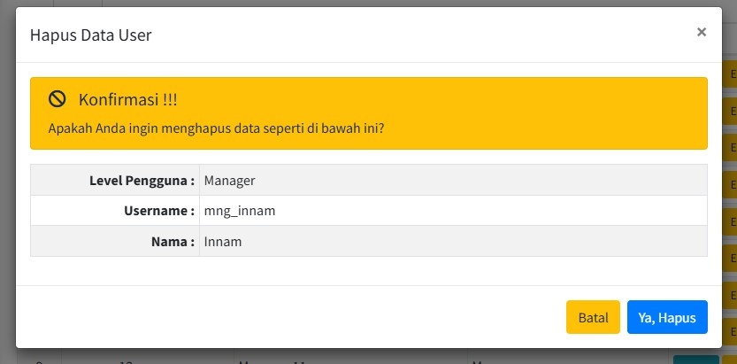 
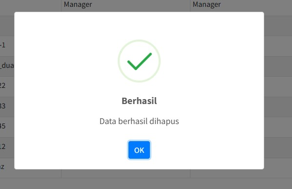 

## Tugas
- Data Level
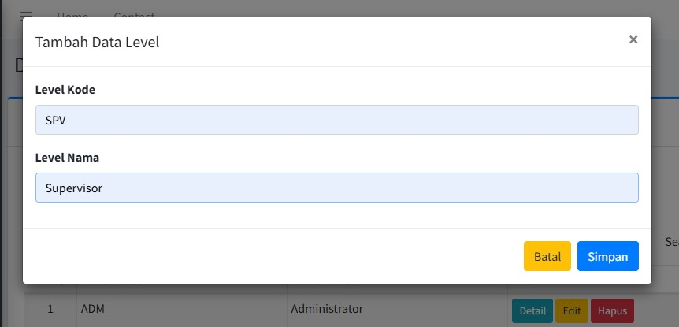 
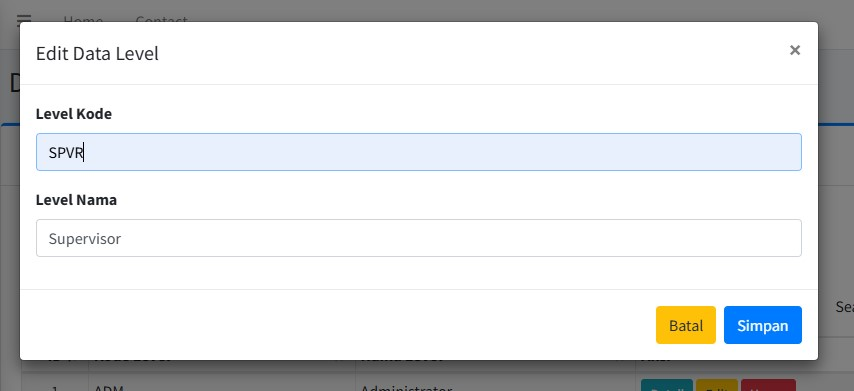 
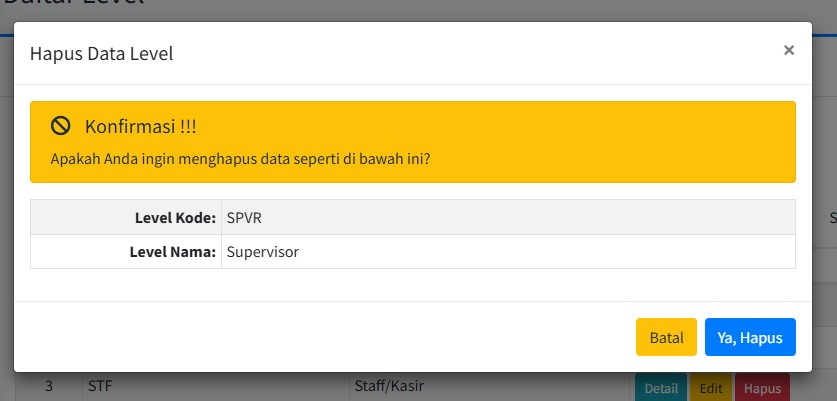 
- Data Kategori
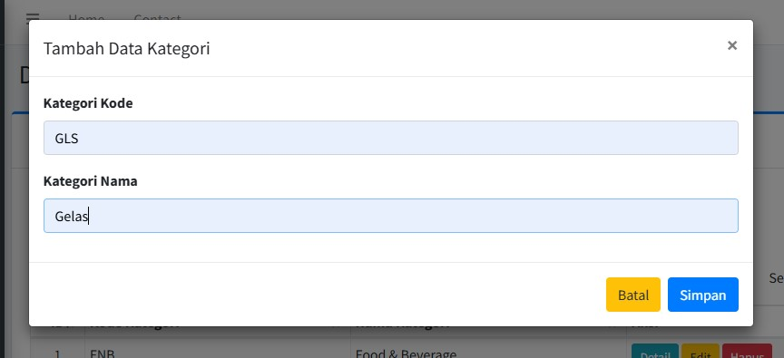 
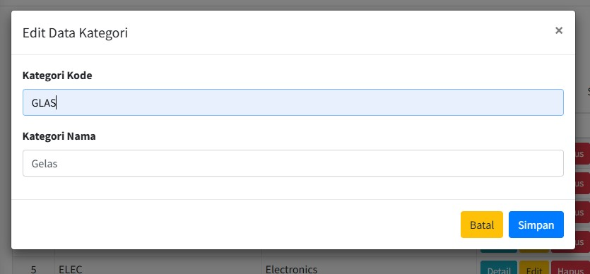 
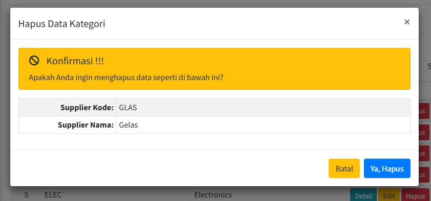 
- Data Supplier
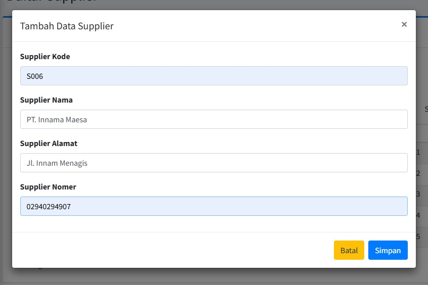 
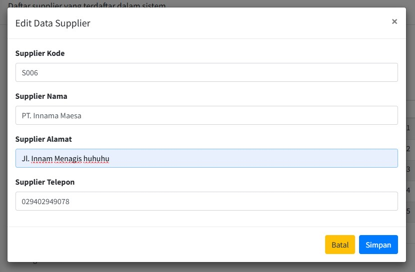 
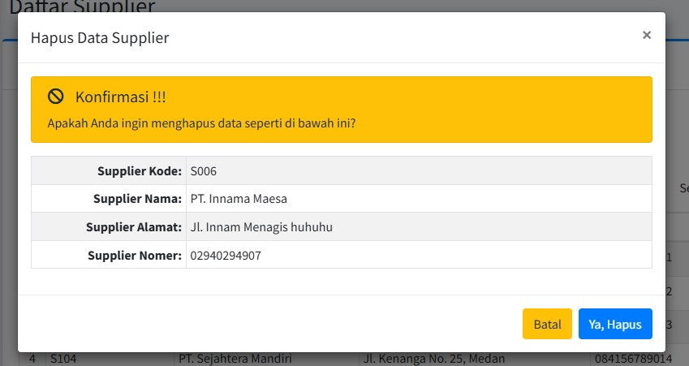 
- Data Barang
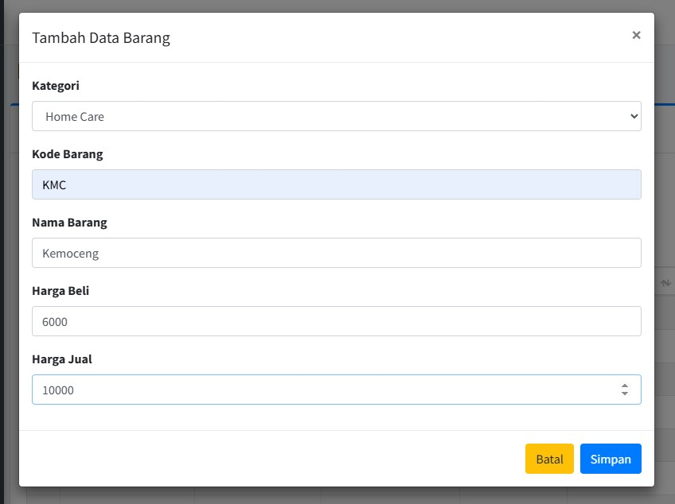 
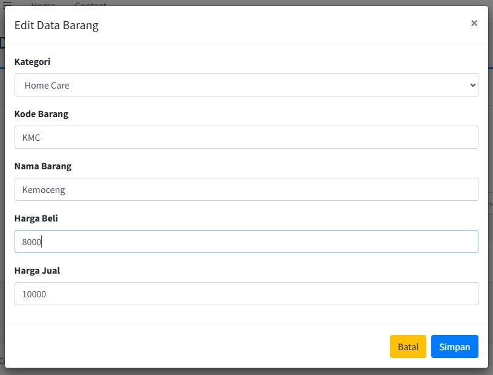 
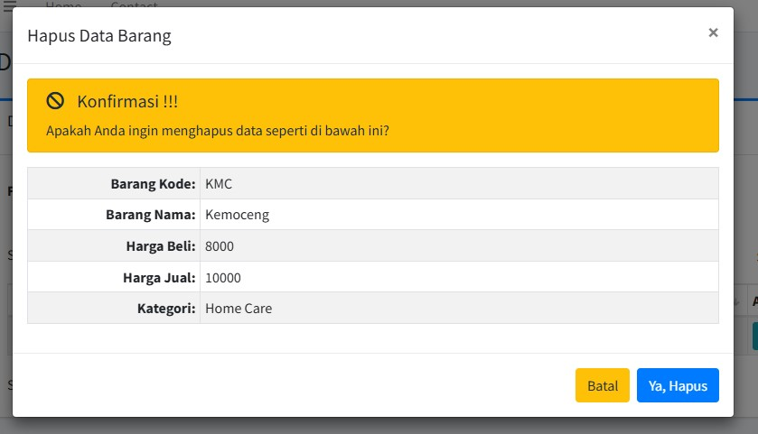 