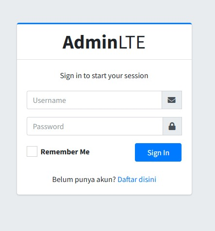
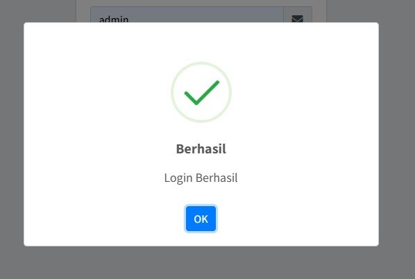
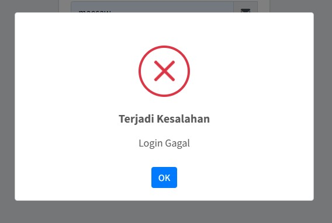
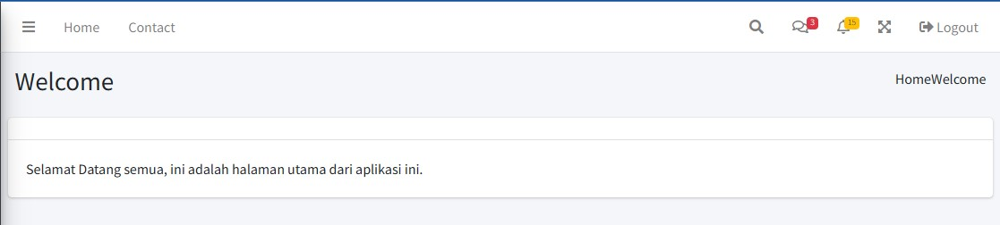
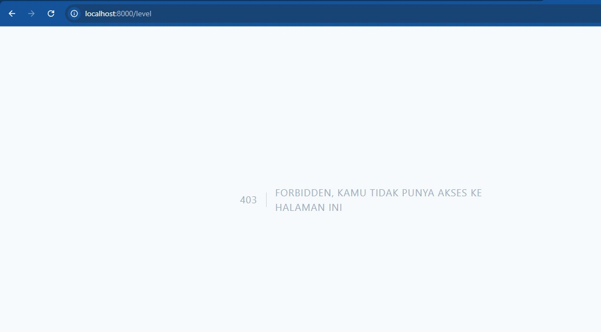
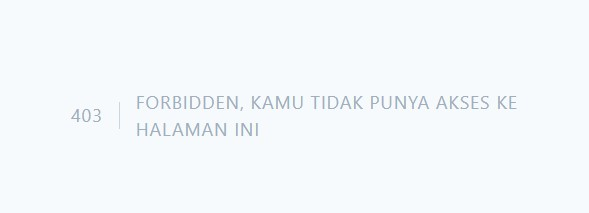
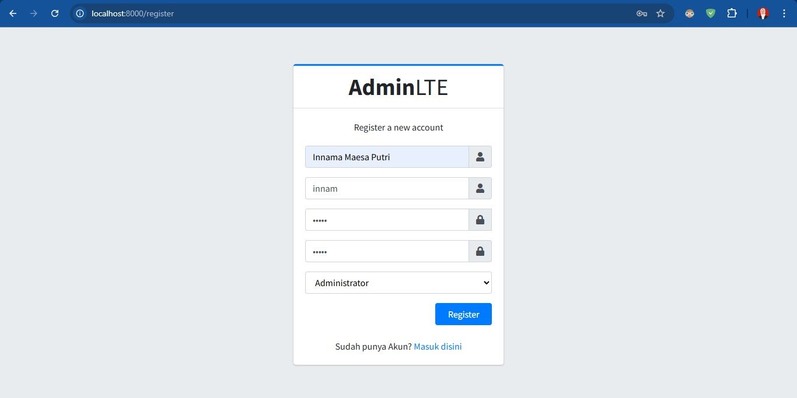
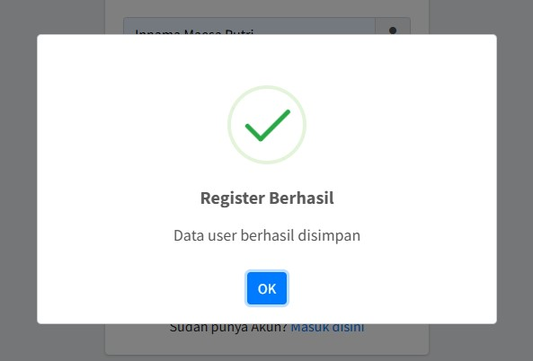

# Laporan Praktikum <br>

Nama        : Innama Maesa Putri <br>
Kelas       : TI 2A <br>
No. Absen   : 13 <br>

## Praktikum 1
Laravel menawarkan sistem autentikasi yang sangat fleksibel. Laravel menyediakan mekanisme autentikasi bawaan melalui layanan authentication scaffolding seperti Laravel Jetstream dan Breeze, yang dapat secara otomatis menghasilkan halaman dan logika autentikasi. Namun, terkadang pengembang memerlukan implementasi autentikasi yang lebih manual untuk memberikan kontrol penuh terhadap setiap aspek dari proses tersebut. <br>
Beberapa komponen penting dalam sistem autentikasi Laravel meliputi: <br>
- Guard: Komponen yang mengatur bagaimana pengguna diautentikasi untuk setiap permintaan. Guard default menggunakan sesi dan cookie. <br>
- Provider: Mengatur bagaimana pengguna diambil dari database atau sumber data lainnya. Provider default mengambil data pengguna dari database dengan menggunakan Eloquent ORM. <br>
- Session: Laravel menggunakan sesi untuk menyimpan status autentikasi pengguna. Sesi memungkinkan sistem untuk mengingat pengguna yang sudah login di antara permintaan HTTP yang berbeda. <br>
Hasil : <br>
<br>

## Tugas 1
1. Silahkan implementasikan proses login pada project kalian masing-masing <br>
Jika login berhasil : <br>
<br>
Jika login gagal : <br>
<br>
2. Silahkan implementasi proses logout pada halaman web yang kalian buat <br>
<br>
Jika button logout di klik, maka session akan terhapus dan pengguna tidak bisa mengakses aplikasi PWL lagi tanpa login, maka dari itu setelah logout redirect ke halaman login. <br>
3. Amati dan jelaskan tiap tahapan yang kalian kerjakan, dan jabarkan dalam laporan <br>
- Login: Pengguna mengirimkan kredensial (biasanya berupa email dan password). <br>
- Verifikasi Kredensial: Sistem memeriksa apakah kredensial yang diberikan sesuai dengan data di database. <br>
- Pembuatan Sesi: Jika kredensial benar, sistem akan membuat sesi untuk pengguna yang akan disimpan di server. <br>
- Akses ke Halaman yang Dilindungi: Pengguna yang terautentikasi dapat mengakses halaman-halaman yang dilindungi oleh middleware auth. <br>
- Logout: Pengguna bisa keluar dari sistem dan sesi mereka akan dihapus. <br>
4. Submit kode untuk impementasi Authentication pada repository github kalian. <br>
 <br>

## Praktikum 2 
Jika login menggunakan akun manager dan mengakses menu level, hasilnya akan seperti berikut <br>
<br>

## Tugas 2
1. Apa yang kalian pahami pada praktikum 2 ini? <br>
Authorization berkenaan dengan hak akses pengguna dalam menggunakan sistem. Authorization memberikan/memastikan hak akses (ijin akses) kita, sesuai dengan aturan (role) yang ada di sistem. Authorization sangat penting untuk membatasi akses
pengguna sesuai dengan peruntukannya. Seperti level manager yang tidak dapat mengakses menu level <br>
2. Amati dan jelaskan tiap tahapan yang kalian kerjakan, dan jabarkan dalam laporan <br>
- Modifikasi `UserModel.php` dengan menambahkan properti/relasi yang mendukung pengecekan role/level.
- Pembuatan middleware `AuthorizeUser.php` menggunakan perintah:
    ```bash
    php artisan make:middleware AuthorizeUser
    ```
- Edit middleware `AuthorizeUser.php`
- Registrasi middleware di file `app/Http/Kernel.php`.
- Modifikasi file `routes/web.php` untuk menerapkan middleware pada route yang ingin dilindungi, misalnya dengan menambahkan keterangan seperti `authorize:ADM` untuk akses administrator. <br>
3. Submit kode untuk impementasi Authorization pada repository github kalian.<br>


## Praktikum 3
Konsepnya hampir sama dengan praktikum 2 namun kali ini, route dapat mengelompokkan role yang dapat mengakses url url yang telah ditentukan <br>
Jika role tidak disertakan dalam middleware route maka hasilnya akan seperti berikut <br>
<br>

## Tugas 3
1. Silahkan implementasikan multi-level authorization pada project kalian masing-masing <br>
2. Amati dan jelaskan tiap tahapan yang kalian kerjakan, dan jabarkan dalam laporan <br>
- Modifikasi `UserModel.php` dengan menambahkan fungsi `getRole()` untuk mendapatkan kode level dari user.
- Penyesuaian pada middleware `AuthorizeUser.php` agar mendukung pengecekan multi-level authorization.
- Perbaikan dan pengaturan ulang route di `routes/web.php` agar dapat mengatur hak akses untuk beberapa level user secara dinamis.
3. Implementasikan multi-level authorization untuk semua Level/Jenis User dan Menu-menu yang sesuai dengan Level/Jenis User <br>
4. Submit kode untuk impementasi Authorization pada repository github kalian. <br>


## Tugas 4
Hasil implementasi register <br>
<br>
Jika register berhasil maka data pengguna telah disimpan dan dapat digunakan untuk proses login.
<br>