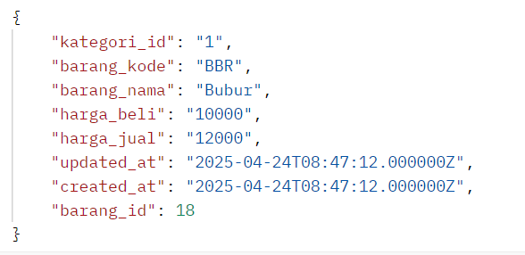

# Laporan Praktikum Jobsheet 10 - RESTful API

## Praktikum 1 - Membuat RESTful API Register

### Langkah-langkah:
1. **Instalasi Postman**  
   Digunakan untuk melakukan pengujian REST API. Unduh dari: https://www.postman.com/downloads.

2. **Instalasi JWT Auth**  
   Jalankan perintah berikut untuk menginstal package JWT:
   ```bash
   composer require tymon/jwt-auth:2.1.1
   ```

3. **Publish Konfigurasi JWT**  
   Jalankan perintah:
   ```bash
   php artisan vendor:publish --provider="Tymon\JWTAuth\Providers\LaravelServiceProvider"
   ```

4. **Generate Secret Key JWT**  
   Jalankan perintah berikut:
   ```bash
   php artisan jwt:secret
   ```
   Key ini akan disimpan di file `.env` sebagai `JWT_SECRET`.

5. **Konfigurasi Auth Guard API**  
   Buka file `config/auth.php`, dan ubah konfigurasi guards bagian `api` agar menggunakan `jwt` sebagai driver.

6. **Modifikasi Model `User`**  
   Tambahkan implementasi `JWTSubject` dan method yang diperlukan agar JWT dapat digunakan pada model User.

7. **Membuat Controller Register**  
   Jalankan perintah:
   ```bash
   php artisan make:controller Api/RegisterController
   ```
   Kemudian tambahkan kode untuk validasi input, pembuatan user baru, dan response JSON.

8. **Update Route API**  
   Tambahkan route berikut ke file `routes/api.php`:
   ```php
   Route::post('/register', [RegisterController::class, 'register']);
   ```

9. **Uji Coba di Postman**  
   - Lakukan request `POST` ke `localhost/PWL_POS/public/api/register`.
   - Coba tanpa mengisi data untuk menguji validasi.
   - Lalu masukkan data (name, email, password, dll) dan klik send.

### Penjelasan:
Pada praktikum ini kita mempelajari bagaimana membuat endpoint untuk registrasi user menggunakan JWT. Proses mencakup validasi data input, pembuatan akun user, dan pengembalian response berupa JSON. Endpoint ini akan menjadi dasar sistem autentikasi API.

### Hasil :
<p>Register tanpa mencantumkan form-data :</p>
<br>
<p>Register setelah mencantumkan form-data :</p>
<br>


## Praktikum 2 - Membuat RESTful API Login

### Langkah-langkah:
1. **Membuat Controller Login**
   Jalankan perintah:
   ```bash
   php artisan make:controller Api/LoginController
   ```

2. **Menambahkan Fungsi Login**
   Update file LoginController untuk:
   - Menerima request email dan password
   - Melakukan autentikasi
   - Mengembalikan token jika berhasil

3. **Menambahkan Route Baru**
   Tambahkan ke `routes/api.php`:
   ```php
   Route::post('/login', [LoginController::class, 'login']);
   Route::get('/user', [LoginController::class, 'getUser']);
   ```

4. **Uji Coba Login**
   - Gunakan Postman, metode `POST`, endpoint `localhost/PWL_POS/public/api/login`
   - Isi dengan data login yang valid

5. **Coba Login dengan Data Salah**
   Uji respons API jika data login salah untuk melihat pesan error.

6. **Cek Data User Login**
   Kirim request `GET` ke `/api/user` dengan header Authorization: Bearer <token>.

### Penjelasan:
Praktikum ini menunjukkan bagaimana mengautentikasi user dengan JWT. Jika login berhasil, sistem mengirimkan token yang dapat digunakan untuk akses endpoint yang dilindungi. Endpoint `/user` mengembalikan informasi user yang sedang login.

### Hasil :
<p>Login tanpa mencantumkan form-data :</p>
<br>
<p>Login setelah mencantumkan form-data :</p>
<br>

## Praktikum 3 - Membuat RESTful API Logout

### Langkah-langkah:
1. **Update File .env**
   Tambahkan:
   ```env
   JWT_SHOW_BLACKLIST_EXCEPTION=true
   ```

2. **Membuat Controller Logout**
   Jalankan perintah:
   ```bash
   php artisan make:controller Api/LogoutController
   ```
   Tambahkan method untuk logout yang menginvalidate token.

3. **Update Routes**
   Tambahkan route logout ke `routes/api.php`:
   ```php
   Route::post('/logout', [LogoutController::class, 'logout']);
   ```

4. **Uji Coba Logout**
   Kirim request `POST` ke endpoint `/api/logout` dengan Bearer Token hasil login.

### Penjelasan:
Praktikum ini menunjukkan cara mengakhiri sesi autentikasi user. Dengan logout, token yang sedang aktif akan di-blacklist sehingga tidak dapat digunakan lagi.

### Hasil :
<p>Logout :</p>
<br>

## Praktikum 4 - Implementasi CRUD dalam RESTful API

### Langkah-langkah:
1. **Membuat Controller Level**
   Jalankan:
   ```bash
   php artisan make:controller Api/LevelController
   ```
   Tambahkan fungsi CRUD: `index`, `store`, `show`, `update`, `destroy`

2. **Update Routes**
   Tambahkan resource route:
   ```php
   Route::apiResource('/levels', LevelController::class);
   ```

3. **Uji Coba GET Semua Data**
   Kirim request `GET` ke `/api/levels` untuk menampilkan semua data level.

4. **Uji Coba POST Tambah Data**
   Kirim request `POST` ke `/api/levels` dengan body data level (misal: nama_level).

5. **Uji Coba GET Detail Data**
   Kirim request `GET` ke `/api/levels/{id}` untuk melihat detail berdasarkan ID.

6. **Uji Coba PUT Update Data**
   Kirim request `PUT` ke `/api/levels/{id}` dengan data perubahan.

7. **Uji Coba DELETE Hapus Data**
   Kirim request `DELETE` ke `/api/levels/{id}` untuk menghapus data.

### Penjelasan:
Praktikum ini menerapkan konsep RESTful API penuh pada tabel `m_level`, mencakup operasi Create, Read, Update, dan Delete. Ini memberikan fleksibilitas untuk mengelola data dari aplikasi frontend atau aplikasi pihak ketiga.

### Hasil :
<p>Menampilkan semua daftar level :</p>
<br>
<p>Menambah level baru :</p>
<br>
<p>Menampilkan detail level :</p>
<br>
<p>Mengedit level :</p>
<br>
<p>Menghapus level :</p>
<br>

## Tugas
Implementasikan fungsi CRUD yang sama seperti praktikum 4 untuk tabel:
- `m_user`
- `m_kategori`
- `m_barang`

Setiap endpoint harus mendukung HTTP method:
- `GET` untuk membaca data
- `POST` untuk menambah data
- `PUT` untuk mengubah data
- `DELETE` untuk menghapus data

### Hasil :
<p>Menampilkan semua daftar user :</p>
<br>
<p>Menampilkan semua daftar kategori :</p>
<br>
<p>Menampilkan semua daftar barang :</p>
<br>
<hr>
<p>Menampilkan detail daftar user :</p>
<br>
<p>Menampilkan detail daftar kategori :</p>
<br>
<p>Menampilkan detail daftar barang :</p>
<br>
<hr>
<p>Menambah user :</p>
<br>
<p>Menambah kategori :</p>
<br>
<p>Menambah barang :</p>
<br>