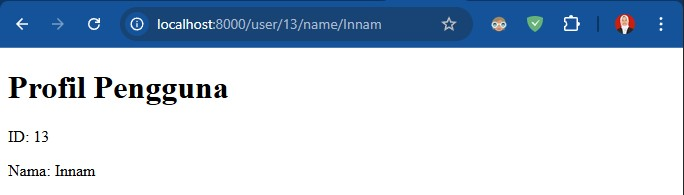

# Daftar Pertanyaan Praktikum

Nama    : Innama Maesa Putri
Kelas   : TI 2A
Absen   : 13

# Jobsheet 2

## Pertanyaan Jobsheet 2
1. Jalankan Langkah-langkah Praktikum pada jobsheet di atas. Lakukan sinkronisasi
perubahan pada project PWL_2025 ke Github.
2. Buatlah project baru dengan nama POS. Project ini merupakan sebuah aplikasi Point of
Sales yang digunakan untuk membantu penjualan.
3. Buatlah beberapa route, controller, dan view sesuai dengan ketentuan sebagai berikut
<table>
    <tr>
        <td>1</td>
        <td>
            <b>Halaman Home</b><br>
            Menampilkan halaman awal website
        </td>
    </tr>
    <tr>
        <td>2</td>
        <td>
            <b>Halaman Products</b><br>
            Menampilkan daftar product (route prefix)<br>
            /category/food-beverage<br>
            /category/beauty-health<br>
            /category/home-care<br>
            /category/baby-kid
        </td>
    </tr>
    <tr>
        <td>3</td>
        <td>
            <b>Halaman User</b><br>
            Menampilkan profil pengguna (route param)<br>
            /user/{id}/name/{name}
        </td>
    </tr>
    <tr>
        <td>4</td>
        <td>
        <b>Halaman Penjualan</b><br>
        Menampilkan halaman transaksi POS
</td>
    </tr>
</table>
4. Route tersebut menjalankan fungsi pada Controller yang berbeda di setiap halaman.
5. Fungsi pada Controller akan memanggil view sesuai halaman yang akan ditampilkan.
6. Simpan setiap perubahan yang dilakukan pada project POS pada Git, sinkronisasi
perubahan ke Github.

## Jawaban
Hasil : <br>





<br>
Nb : Untuk kode program terdapat pada folder PWL_POS

# Jobsheet 3

## Pertanyaan Jobsheet 3
1. Pada Praktikum 1 - Tahap 5, apakah fungsi dari APP_KEY pada file setting .env Laravel?
2. Pada Praktikum 1, bagaimana kita men-generate nilai untuk APP_KEY?
3. Pada Praktikum 2.1 - Tahap 1, secara default Laravel memiliki berapa file migrasi?
dan untuk apa saja file migrasi tersebut?
4. Secara default, file migrasi terdapat kode $table->timestamps();, apa tujuan/output
dari fungsi tersebut?
5. Pada File Migrasi, terdapat fungsi $table->id(); Tipe data apa yang dihasilkan dari
fungsi tersebut?
6. Apa bedanya hasil migrasi pada table m_level, antara menggunakan $table->id();
dengan menggunakan $table->id('level_id'); ?
7. Pada migration, Fungsi ->unique() digunakan untuk apa?
8. Pada Praktikum 2.2 - Tahap 2, kenapa kolom level_id pada tabel m_user
menggunakan $tabel->unsignedBigInteger('level_id'), sedangkan kolom level_id
pada tabel m_level menggunakan $tabel->id('level_id') ?
9. Pada Praktikum 3 - Tahap 6, apa tujuan dari Class Hash? dan apa maksud dari kode
program Hash::make('1234');?
10. Pada Praktikum 4 - Tahap 3/5/7, pada query builder terdapat tanda tanya (?), apa
kegunaan dari tanda tanya (?) tersebut?
11. Pada Praktikum 6 - Tahap 3, apa tujuan penulisan kode protected $table =
‘m_user’; dan protected $primaryKey = ‘user_id’; ?
12. Menurut kalian, lebih mudah menggunakan mana dalam melakukan operasi CRUD ke
database (DB Façade / Query Builder / Eloquent ORM) ? jelaskan


## Jawaban
1. **APP_KEY** digunakan untuk enkripsi data dalam Laravel, seperti hashing password dan session encryption.

2. Gunakan perintah berikut untuk **men-generate APP_KEY** di `.env`:  
   ```bash
   php artisan key:generate
   ```  

3. Secara default, Laravel memiliki **tiga file migrasi**:  
   - `create_users_table.php` → Untuk tabel pengguna  
   - `create_password_reset_tokens_table.php` → Untuk menyimpan token reset password 
   - `create_failed_jobs_table.php` → Untuk mencatat pekerjaan (jobs) yang gagal  

4. **`$table->timestamps();`** secara otomatis menambahkan kolom `created_at` dan `updated_at` untuk mencatat waktu pembuatan dan pembaruan data.  

5. **`$table->id();`** menghasilkan kolom bertipe `BIGINT UNSIGNED AUTO_INCREMENT PRIMARY KEY`.  

6. **Perbedaan `id()` dan `id('level_id')`**:  
   - `id();` → Nama kolom default adalah `id`.  
   - `id('level_id');` → Nama kolom menjadi `level_id`, tetapi tetap bertipe `BIGINT UNSIGNED AUTO_INCREMENT`.  

7. **`->unique()`** digunakan untuk memastikan nilai dalam kolom tertentu **tidak boleh duplikat**.  

8. **Kolom `level_id` di `m_user` menggunakan `unsignedBigInteger` karena bertindak sebagai foreign key**, sedangkan di `m_level` menggunakan `id('level_id')` karena merupakan **primary key** dengan auto-increment.  

9. **Class `Hash`** digunakan untuk mengenkripsi password.  
   - `Hash::make('1234');` menghasilkan password yang di-hash untuk keamanan, misalnya:  
     ```php
     $hashed = '$2y$10$...';
     ```  

10. **Tanda tanya (`?`) dalam query builder** digunakan sebagai **binding parameter** untuk mencegah SQL Injection.  

11. **Kode `protected $table = 'm_user';` dan `protected $primaryKey = 'user_id';`** digunakan untuk menentukan nama tabel dan primary key secara manual dalam model Eloquent.  

12. **Eloquent ORM lebih mudah digunakan dibandingkan DB Façade atau Query Builder** karena sintaksnya lebih ringkas dan berbasis objek. Namun, **Query Builder lebih fleksibel untuk query kompleks**, sementara **DB Façade lebih dekat ke SQL asli**.